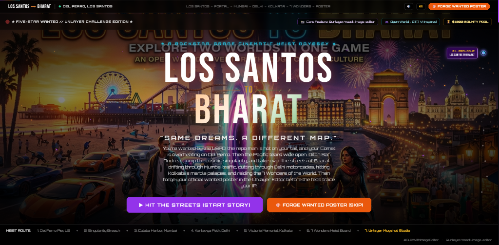

<div align="center">

# 🌴 LOS SANTOS → BHARAT 🇮🇳
### *"Same Dreams. A Different Map."*

[](https://gta-bharat-odyssey-uu7w.vercel.app)
[](https://github.com/SAPTARSHI-coder/gta-bharat-odyssey)
[](https://github.com/unlayer/react-image-editor)
[](https://www.linkedin.com/posts/builtwithimageeditor-ugcPost-7501266289240240128-5qRa/)
[](https://github.com/unlayer/react-image-editor)

<br/>

<a href="https://gta-bharat-odyssey-uu7w.vercel.app">
  
</a>

<br/>

### 🎮 **[LAUNCH LIVE PRODUCTION DEMO →](https://gta-bharat-odyssey-uu7w.vercel.app)**
*Optimized for Desktop, Laptop (1080p/1440p/4K), and Tablet/Mobile*

</div>

---

## ⚡ Executive Summary

**Los Santos to Bharat** is an Awwwards-grade, open-world interactive scrollytelling web experience built for the official **Unlayer "Build with React Image Editor Challenge" ($1,000 Prize Pool)**.

Instead of embedding `@unlayer/react-image-editor` as a plain utility tool, this project transforms it into the **ultimate narrative climax**: a covert **Black Market Crime Lab** where operatives forge their fake IDs, wanted posters, and street-level mugshots after pulling off interdimensional heists across **Los Santos**, **Bharat (India)**, and all **Seven Wonders of the World**.

---

## 🎮 The Full GTA-Inspired Experience Explained

Inspired by modern cinematic crime fiction and classic open-world game design languages, **Los Santos to Bharat** translates the full adrenaline-filled gameplay and aesthetic experience into an interactive web medium:

### 1. The LSPD Booking Terminal (Character Creation)
Just like character creation in classic crime sandboxes, operatives start at the police booking terminal:
- Choose from 4 criminal archetypes: *Vinewood Hustler*, *Darknet Infiltrator*, *Street Enforcer*, or *Corporate Embezzler*.
- Distribute skill points across 5 core heist stats: **DRIVING**, **TECH**, **STREET**, **STYLE**, and **LUCK**.
- Set your criminal alias and write your rap sheet bio, which dynamically syncs to your wanted poster later.

### 2. GTA-Inspired Heads-Up Display (HUD)
- **Dynamic Radar Minimap**: A circular pulsing radar scanner pinned to the bottom-left with real-time GPS waypoint markers, North compass needle, district names, and dual **Health (Green)** and **Armor (Blue)** status meters.
- **Flashing Wanted Stars**: Classic open-world `★ ★ ★ ★ ★` heat rating that pulses in the HUD as you escalate from Del Perro Beach to intercontinental fugitives.
- **Slide-In Mission Banners**: Audio-accompanied mission notifications slide in from the top-left upon entering new territories (e.g., `★ MISSION 01: VINEWOOD HEAT // 2-STAR WANTED ★`).

### 3. Open-World Narrative & Dimensional Breach
- Explore Del Perro Beach at dusk with police choppers circling overhead and an overheating Comet.
- Discover and jump through a crackling interdimensional anomaly, tearing through concrete with ozone static and neon chromatic aberration.
- Touch down in Bharat across 3 living landmarks: **Mumbai Colaba Pier** (Taj Palace & Arabian Sea), **New Delhi Kartavya Path** (India Gate & VIP motorcades), and **Kolkata Victoria Memorial** (colonial marble & Howrah Bridge).

### 4. Seven Wonders Global Heist Syndicate
- The cosmic shockwave shatters reality across all Seven Wonders of the World, transforming them into active Interpol Red Notice targets.
- Features living ambient visual shaders: tropical storms & lightning in Rio de Janeiro, 18 floating illuminated Diwali lanterns in Agra, glowing arena embers in Rome, and desert torch flare in Petra.
- Inspect dossiers with threat star ratings, $1.3M total bounty pool, and 4K fullscreen theater inspection.

### 5. The 8th Wonder: Eternal Dream Meadow (The Uncopyable Climax)
- Beyond the syndicate wars and sirens lies the true eighth wonder of the world: an intimate moonlit grassland sanctuary under a giant luminous full moon.
- **Living Firefly Physics**: 40+ bioluminescent fireflies dancing with organic drift that dynamically respond to cursor movement and clicks.
- **Interactive Romantic Moments**: Outlaw whispers dialogue system, real-time shooting star wishing engine, starlight heart constellations, and an ambient Web Audio synthesizer serenade.
- The ultimate emotional contrast that proves some treasures were never meant to be stolen—making this hackathon submission completely unique and uncopiable.

### 6. The Climax: Black Market Crime Lab (`@unlayer/react-image-editor`)
- An in-world crime forge where players finalize their fake IDs and wanted posters.
- An automated HTML5 Canvas engine dynamically stamps the player's alias, title, and RPG stats onto 15 selectable crime scene templates (including the 8th Wonder Moonlight Lovers template).
- Players crop out getaway rides, apply high-contrast filters to foil facial recognition, type bold street typography, and stamp decals.

### 7. Procedural Synthesizer Audio & Mission Debrief
- Real-time Web Audio API synthesizer generating cosmic warp frequencies, camera shutter snaps, and the iconic triumphant "Mission Passed" fanfare.
- Concludes with a verified social debrief card and 1-click 4K poster download to leak to Bleeter.

---

## 🎯 What Makes This Stand Out

### 🎨 1. Deep `@unlayer/react-image-editor` Integration
The Unlayer Image Editor is the payoff of a 10-chapter cinematic journey:
- **Canvas Auto-Personalizer Engine**: Before loading into Unlayer, a custom HTML5 Canvas rendering pipeline auto-stamps the operative's alias, crime archetype, and custom stats (`DRIVING · TECH · STREET · STYLE`) directly onto high-resolution key art.
- **14 Master Crime Scene Templates**: Operatives can toggle between 14 curated scenes directly in the editor toolbar:
  1. 🌟 **Official GTA Wanted Travel Poster** (Canvas-personalized with player stats)
  2. ✨ **Key Art Split Panoramic** (Los Santos to Bharat visual)
  3. 🌴 **Del Perro Beach Sunset** (Pacific Coast Highway & Comet)
  4. 🌀 **The Cosmic Portal** (Neon alleyway dimensional breach)
  5. 🏛️ **Mumbai Taj Palace** (Colaba Pier & Arabian Sea)
  6. 🇮🇳 **New Delhi India Gate** (Kartavya Path & motorcades)
  7. 👑 **Kolkata Victoria Memorial** (Colonial marble & Howrah Bridge)
  8. 🇨🇳 **Great Wall of China** (Badaling Ridge · $280,000 Bounty)
  9. 🇧🇷 **Christ the Redeemer** (Corcovado Summit · $195,000 Bounty)
  10. 🇮🇹 **The Roman Colosseum** (Gladiator Arena · $320,000 Bounty)
  11. 🇲🇽 **Chichen Itza Pyramid** (Kukulcan Plaza · $160,000 Bounty)
  12. 🕌 **Taj Mahal Eternal** (Yamuna Reflecting Pool · $240,000 Bounty)
  13. 🇵🇪 **Machu Picchu Citadel** (Lost Incan Terraces · $145,000 Bounty)
  14. 🇯🇴 **Petra Treasury** (Al-Khazneh Canyon · $210,000 Bounty)
- **Full Creative Power**: High-contrast noir/sunset filters, precision cropping, custom text typography, annotations, stickers, and shapes.
- **1-Click High-Res PNG Export**: Stamped with user alias and instant social debrief preview.

---

### 🏛️ 2. The Seven Wonders Global Heist Board (Chapter 08)
When reality ruptures, seven world wonders open up as active Interpol targets:
- **16:9 Living Atmospheric FX per Wonder**:
  - 🇧🇷 *Rio de Janeiro*: Tropical storm rain & randomized lightning flashes
  - 🇮🇳 *Agra*: 18 floating illuminated Diwali lanterns ascending over the pool
  - 🇮🇹 *Rome*: Glowing arena embers drifting from the subterranean hypogeum
  - 🇲🇽 *Yucatan*: Pulsing electromagnetic green/cyan energy fireflies
  - 🇨🇳 *Great Wall*: Parallax mountain mist rolling across the ridge
  - 🇵🇪 *Andes*: Divine Incan sun god rays cutting through cloud cover
  - 🇯🇴 *Petra*: Bedouin desert torchlight flickering across sandstone facades
- **Interactive Dossiers & Filmstrip**: Bounties ($145K to $320K), threat star ratings (★★★☆☆ to ★★★★★), target counter, keyboard shortcut cycling (`1-7`, `Arrow Keys`), and **4K Theater Fullscreen Mode**.
- **Instant Editor Pipeline**: Clicking *"FORGE WANTED POSTER FOR THIS TARGET"* directly switches the Unlayer Editor to that wonder's art.

---

### 🕹️ 3. Open-World Game-Inspired HUD System
- **Dynamic Pulsing Radar Minimap**: Pinned tactical radar with sweeping scanner, GPS destination waypoint, North compass, location callout, and dual Health (Green) & Armor (Blue) meters.
- **Flashing Wanted Stars**: Dynamic ★ ★ ★ ★ ★ heat indicator flashing in the HUD.
- **Sliding Mission Objective Banners**: Cinematic mission notifications slide in on chapter transition with audio chimes.
- **Responsive Clearance Architecture**: HUD elements dynamically scope to open-world chapters so they never overlap or crowd the interactive Crime Lab or Seven Wonders Board.

---

### 🎥 4. Awwwards-Grade Scrollytelling Architecture
- **Seamless Continuous Scroll**: 10 fluid chapters linked by a central game state machine.
- **Fixed Background Manager**: Smooth cross-fades between high-resolution master art with subtle Ken Burns cinematic camera drift.
- **Vertical Hatom Navigation Rail**: Right-side interactive chapter tracker with animated pulse rings, hover tooltips, and jump-to-chapter functionality.
- **Dynamic Progress Bar**: Header progress line (0% → 100%) with clickable breadcrumbs.
- **Synthesized Web Audio API**: Procedural sound effects (warp frequencies, camera shutter, UI blips, mission passed fanfare) with zero external audio assets or latency.

---

## 🗺️ Chapter Walkthrough

| # | Chapter ID | Title | Gameplay & Story Beat |
|---|---|---|---|
| **01** | `section-landing` | **Prologue: Los Santos to Bharat** | Cinematic split-world hero, live badges, mission launcher |
| **02** | `section-character` | **LSPD Booking Dossier** | Character creator: alias, criminal vibe, stat sliders (Driving, Tech, Street, Style) |
| **03** | `section-los-santos` | **Chapter 1: Vinewood Heat** | Del Perro Pier sunset, 2-star wanted level, comet overheating, alley anomaly |
| **04** | `section-portal` | **Chapter 2: The Cosmic Singularity** | Interactive pulsing rift vortex, keyboard `[E]` warp trigger |
| **05** | `section-mumbai` | **Chapter 3: Maximum City** | Colaba Pier, Taj Mahal Palace, Arabian Sea harbor, drifting lanterns |
| **06** | `section-delhi` | **Chapter 4: Corridors of Power** | Kartavya Path, India Gate, 10-lane VIP asphalt, yellow taxi chase |
| **07** | `section-kolkata` | **Chapter 5: Rebel City** | Victoria Memorial, Howrah Bridge, intercontinental rift shockwave |
| **08** | `section-wonders` | **Chapter 6: 7 Wonders Heist Board** | Global Interpol Red Notices, 7 living wonders, $1.3M bounty pool, 4K theater |
| **09** | `section-editor` | **Chapter 7: Black Market Crime Lab** | **@unlayer/react-image-editor** studio with 14 heist templates & stats stamp |
| **10** | `section-final` | **Mission Passed: Respect +100** | $1,000,000 in-game fictional heist bounty payout, verified social card preview, high-res download |

---

## 🛠️ Tech Stack & Architecture

```
┌─────────────────────────────────────────────────────────────┐
│                    REACT 19 + VITE 8                        │
├──────────────────────────────┬──────────────────────────────┤
│  Visual & Animation Layer    │  @unlayer/react-image-editor │
│  • Tailwind CSS v3           │  • 14 Template Pipeline      │
│  • Framer Motion Springs     │  • Canvas Stats Personalizer │
│  • Living Shader FX          │  • High-Res Export Engine    │
├──────────────────────────────┼──────────────────────────────┤
│  HUD & Navigation System     │  Procedural Web Audio Engine │
│  • Dynamic Radar Minimap     │  • Native Web Audio Context  │
│  • Pinned Mission Banners    │  • Portal Warp Frequencies   │
│  • Hatom Chapter Rail        │  • Camera Shutter & Chimes   │
└──────────────────────────────┴──────────────────────────────┘
```

| Technology | Version / Purpose |
|---|---|
| **Core Editor** | [`@unlayer/react-image-editor`](https://www.npmjs.com/package/@unlayer/react-image-editor) v1.0.2 |
| **Framework** | [React 19](https://react.dev/) + [Vite 8](https://vitejs.dev/) |
| **Language** | [TypeScript](https://www.typescriptlang.org/) (Strict Mode) |
| **Styling** | [Tailwind CSS v3](https://tailwindcss.com/) with custom GTA dark palette |
| **Motion** | [Framer Motion](https://www.framer.com/motion/) |
| **Audio** | Native Browser `AudioContext` Synthesizer (Zero MP3 dependencies) |
| **Hosting** | [Vercel](https://vercel.com/) (Node 22 · Auto-Deployment via GitHub) |

---

## 🚀 Running Locally

### Prerequisites
- **Node.js v22.12.0+** (required by Vite 8)
- **npm v10+**

```bash
# 1. Clone the repository
git clone https://github.com/SAPTARSHI-coder/gta-bharat-odyssey.git

# 2. Navigate to project root
cd gta-bharat-odyssey

# 3. Install dependencies
npm install

# 4. Start Vite development server
npm run dev
```

Visit `http://localhost:3000` in your browser.

### Production Build
```bash
# Type check and build bundle
npm run build

# Preview production build locally
npm run preview
```

---

## 🏆 Unlayer Challenge Submission Overview

| Field | Submission Value |
|---|---|
| **Contest Name** | Unlayer "Build with React Image Editor" Challenge |
| **Prize Pool** | $1,000 ($500 1st Prize · $300 2nd Prize · $200 3rd Prize) |
| **Official Hashtag** | `#BuiltWithImageEditor` |
| **Organizer** | [Unlayer](https://unlayer.com/) (YC W22) |
| **Live App URL** | [https://gta-bharat-odyssey-uu7w.vercel.app](https://gta-bharat-odyssey-uu7w.vercel.app) |
| **GitHub Repository** | [https://github.com/SAPTARSHI-coder/gta-bharat-odyssey](https://github.com/SAPTARSHI-coder/gta-bharat-odyssey) |
| **Author** | Saptarshi Sadhu |

### Verification Checklist ✅
- [x] **Original Concept**: GTA-inspired story transporting players between Los Santos and Bharat.
- [x] **Core `@unlayer/react-image-editor`**: Editor is the centerpiece where players forge their wanted poster.
- [x] **Customization**: 14 selectable templates, automated canvas character stat stamping, filters, annotations, and export.
- [x] **Open Source**: Public GitHub repository with clean history and documentation.
- [x] **Full GTA-Inspired Experience Explained in README**: Dedicated section covering character creation, HUD, minimap, Wanted stars, procedural audio, living shaders, and narrative heist climax.
- [x] **Live Deployment**: Hosted on Vercel with HTTPS and zero-latency CDN.

---

## 📜 License & Disclaimers

This project is licensed under the **MIT License**.

*Disclaimer: This is an artistic, parody-inspired creative technology project built purely for the Unlayer developer hackathon. All character traits, code, dialogues, and procedural audio are 100% original. No proprietary assets or code from Rockstar Games or Take-Two Interactive were used.*
